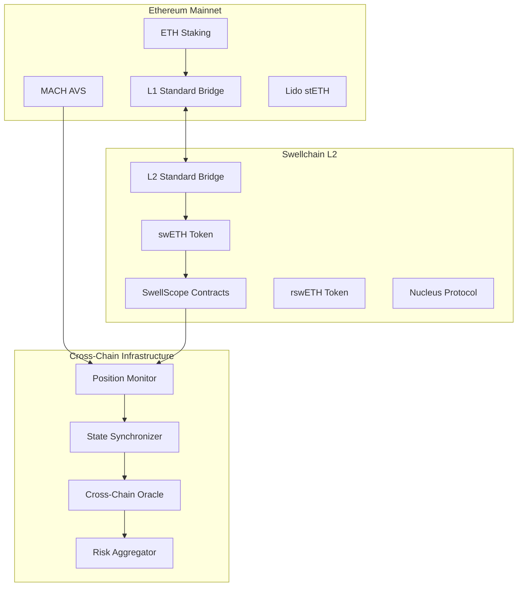

# Cross-Chain Architecture

SwellScope's cross-chain architecture enables seamless monitoring and management of restaking positions across Ethereum and Swellchain. This document outlines our multi-chain design, bridge integrations, and cross-chain risk management strategies.

## Architecture Overview

### Multi-Chain Strategy

SwellScope operates across two primary networks:

1. **Ethereum Mainnet**: Source of staked ETH and MACH AVS integration
2. **Swellchain**: Primary execution environment for restaking operations
3. **Future Chains**: Planned expansion to other Superchain networks

### Cross-Chain Components



## Bridge Architecture

### Standard Bridge Integration

SwellScope integrates with Optimism's Standard Bridge for secure asset transfers:

```typescript
interface CrossChainBridge {
  // L1 → L2 Deposits
  depositETHTo(
    recipient: string,
    minGasLimit: number,
    extraData: string
  ): Promise<string>;
  
  depositERC20To(
    l1Token: string,
    l2Token: string,
    recipient: string,
    amount: bigint,
    minGasLimit: number,
    extraData: string
  ): Promise<string>;
  
  // L2 → L1 Withdrawals
  withdraw(
    l2Token: string,
    amount: bigint,
    minGasLimit: number,
    extraData: string
  ): Promise<string>;
  
  finalizeWithdrawal(
    withdrawalTransaction: WithdrawalTransaction
  ): Promise<string>;
}
```

### Real Bridge Addresses

```typescript
// Production Bridge Contracts
const BRIDGE_CONTRACTS = {
  ethereum: {
    l1StandardBridge: "0x...", // Ethereum L1 Bridge
    l1CrossDomainMessenger: "0x...", // L1 Messenger
    optimismPortal: "0x...", // Portal contract
  },
  swellchain: {
    l2StandardBridge: "0x4200000000000000000000000000000000000010",
    l2CrossDomainMessenger: "0x4200000000000000000000000000000000000007",
    l2ToL1MessagePasser: "0x4200000000000000000000000000000000000016",
  }
};
```

### Bridge Operation Monitoring

```typescript
class BridgeMonitor {
  private readonly l1Provider = new ethers.JsonRpcProvider(process.env.ETHEREUM_RPC_URL);
  private readonly l2Provider = new ethers.JsonRpcProvider("https://swell-mainnet.alt.technology");
  
  async monitorBridgeOperations(): Promise<void> {
    // Monitor L1 → L2 deposits
    const l1Bridge = new ethers.Contract(
      BRIDGE_CONTRACTS.ethereum.l1StandardBridge,
      L1_BRIDGE_ABI,
      this.l1Provider
    );
    
    l1Bridge.on("ERC20DepositInitiated", async (
      l1Token: string,
      l2Token: string,
      from: string,
      to: string,
      amount: bigint,
      extraData: string,
      event: any
    ) => {
      await this.handleDepositInitiated({
        l1Token,
        l2Token,
        from,
        to,
        amount,
        transactionHash: event.transactionHash,
        blockNumber: event.blockNumber
      });
    });
    
    // Monitor L2 → L1 withdrawals
    const l2Bridge = new ethers.Contract(
      BRIDGE_CONTRACTS.swellchain.l2StandardBridge,
      L2_BRIDGE_ABI,
      this.l2Provider
    );
    
    l2Bridge.on("WithdrawalInitiated", async (
      l1Token: string,
      l2Token: string,
      from: string,
      to: string,
      amount: bigint,
      extraData: string,
      event: any
    ) => {
      await this.handleWithdrawalInitiated({
        l1Token,
        l2Token,
        from,
        to,
        amount,
        transactionHash: event.transactionHash,
        blockNumber: event.blockNumber
      });
    });
  }
  
  async getBridgeStatus(operationId: string): Promise<BridgeStatus> {
    const operation = await this.database.getBridgeOperation(operationId);
    
    if (operation.direction === 'L1_TO_L2') {
      return await this.getDepositStatus(operation);
    } else {
      return await this.getWithdrawalStatus(operation);
    }
  }
  
  private async getDepositStatus(operation: BridgeOperation): Promise<BridgeStatus> {
    // Check if L2 transaction is confirmed
    const l2Receipt = await this.l2Provider.getTransactionReceipt(operation.l2TransactionHash);
    
    if (l2Receipt) {
      return {
        status: 'completed',
        l1TransactionHash: operation.l1TransactionHash,
        l2TransactionHash: operation.l2TransactionHash,
        completionTime: new Date(l2Receipt.blockNumber * 2000), // Approximate
        estimatedGasUsed: l2Receipt.gasUsed
      };
    }
    
    // Check if still in mempool or failed
    const l1Receipt = await this.l1Provider.getTransactionReceipt(operation.l1TransactionHash);
    if (l1Receipt && l1Receipt.status === 0) {
      return { status: 'failed', error: 'L1 transaction reverted' };
    }
    
    return { status: 'pending', estimatedCompletion: this.estimateL2Confirmation() };
  }
}
```

## Cross-Chain Position Tracking

### Position Aggregation

```typescript
interface CrossChainPosition {
  user: string;
  totalValue: {
    ethereum: bigint;
    swellchain: bigint;
    bridgeInTransit: bigint;
    total: bigint;
  };
  breakdown: {
    ethereum: {
      stakedETH: bigint;
      unstakingETH: bigint;
      liquidETH: bigint;
      machStaked: bigint;
    };
    swellchain: {
      swETH: bigint;
      rswETH: bigint;
      vaultShares: bigint;
      nucleusShares: bigint;
    };
  };
  riskMetrics: {
    ethereumRisk: number;
    swellchainRisk: number;
    bridgeRisk: number;
    compositeRisk: number;
  };
  lastUpdate: Date;
}

class CrossChainPositionTracker {
  async aggregateUserPosition(userAddress: string): Promise<CrossChainPosition> {
    // Get Ethereum positions
    const ethereumPositions = await this.getEthereumPositions(userAddress);
    
    // Get Swellchain positions
    const swellchainPositions = await this.getSwellchainPositions(userAddress);
    
    // Get bridge operations in transit
    const bridgeOperations = await this.getBridgeOperations(userAddress);
    
    return {
      user: userAddress,
      totalValue: {
        ethereum: ethereumPositions.totalValue,
        swellchain: swellchainPositions.totalValue,
        bridgeInTransit: bridgeOperations.totalInTransit,
        total: ethereumPositions.totalValue + swellchainPositions.totalValue + bridgeOperations.totalInTransit
      },
      breakdown: {
        ethereum: ethereumPositions.breakdown,
        swellchain: swellchainPositions.breakdown
      },
      riskMetrics: await this.calculateCrossChainRisk(userAddress),
      lastUpdate: new Date()
    };
  }
  
  private async getEthereumPositions(userAddress: string): Promise<EthereumPositions> {
    const provider = this.l1Provider;
    
    // Check staked ETH positions
    const stakedETH = await this.getStakedETHBalance(userAddress);
    
    // Check MACH AVS positions
    const machStaked = await this.getMACHStakedAmount(userAddress);
    
    // Check liquid ETH
    const liquidETH = await provider.getBalance(userAddress);
    
    return {
      totalValue: stakedETH + machStaked + liquidETH,
      breakdown: {
        stakedETH,
        unstakingETH: await this.getUnstakingETH(userAddress),
        liquidETH,
        machStaked
      }
    };
  }
  
  private async getSwellchainPositions(userAddress: string): Promise<SwellchainPositions> {
    const provider = this.l2Provider;
    
    // Check swETH balance
    const swETH = await this.getTokenBalance(userAddress, TOKENS.swETH);
    
    // Check rswETH balance (when deployed)
    const rswETH = await this.getTokenBalance(userAddress, TOKENS.rswETH);
    
    // Check SwellScope vault shares
    const vaultShares = await this.getVaultShares(userAddress);
    
    // Check Nucleus positions
    const nucleusShares = await this.getNucleusShares(userAddress);
    
    return {
      totalValue: swETH + rswETH + vaultShares + nucleusShares,
      breakdown: {
        swETH,
        rswETH,
        vaultShares,
        nucleusShares
      }
    };
  }
}
```

### Real-Time Synchronization

```typescript
class CrossChainSynchronizer {
  private syncInterval = 30000; // 30 seconds
  private websockets = new Map<string, WebSocket>();
  
  async startRealTimeSync(): Promise<void> {
    // Setup WebSocket connections to both networks
    await this.setupEthereumSync();
    await this.setupSwellchainSync();
    
    // Start periodic full synchronization
    setInterval(() => {
      this.performFullSync();
    }, this.syncInterval);
  }
  
  private async setupEthereumSync(): Promise<void> {
    const ws = new WebSocket(process.env.ETHEREUM_WSS_URL);
    
    ws.on('open', () => {
      // Subscribe to relevant events
      ws.send(JSON.stringify({
        id: 1,
        method: "eth_subscribe",
        params: ["logs", {
          topics: [
            ethers.id("Transfer(address,address,uint256)"),
            null,
            ethers.zeroPadValue(BRIDGE_CONTRACTS.ethereum.l1StandardBridge, 32)
          ]
        }]
      }));
    });
    
    ws.on('message', async (data) => {
      const event = JSON.parse(data.toString());
      if (event.params?.result) {
        await this.handleEthereumEvent(event.params.result);
      }
    });
    
    this.websockets.set('ethereum', ws);
  }
  
  private async setupSwellchainSync(): Promise<void> {
    const ws = new WebSocket("wss://swell-mainnet.alt.technology");
    
    ws.on('open', () => {
      // Subscribe to SwellScope vault events
      ws.send(JSON.stringify({
        id: 1,
        method: "eth_subscribe",
        params: ["logs", {
          address: process.env.SWELLSCOPE_VAULT_ADDRESS,
          topics: [
            [
              ethers.id("Deposit(address,address,uint256,uint256)"),
              ethers.id("Withdraw(address,address,address,uint256,uint256)")
            ]
          ]
        }]
      }));
    });
    
    ws.on('message', async (data) => {
      const event = JSON.parse(data.toString());
      if (event.params?.result) {
        await this.handleSwellchainEvent(event.params.result);
      }
    });
    
    this.websockets.set('swellchain', ws);
  }
  
  async performFullSync(): Promise<void> {
    const users = await this.getActiveUsers();
    
    for (const user of users) {
      try {
        const position = await this.aggregateUserPosition(user);
        await this.updatePositionCache(user, position);
        
        // Check for significant changes
        const previousPosition = await this.getPreviousPosition(user);
        if (this.hasSignificantChange(previousPosition, position)) {
          await this.notifyPositionChange(user, position);
        }
      } catch (error) {
        console.error(`Failed to sync position for user ${user}:`, error);
      }
    }
  }
}
```

## Cross-Chain Risk Management

### Multi-Chain Risk Assessment

```typescript
class CrossChainRiskManager {
  async calculateCrossChainRisk(userAddress: string): Promise<CrossChainRiskMetrics> {
    // Get individual chain risks
    const ethereumRisk = await this.calculateEthereumRisk(userAddress);
    const swellchainRisk = await this.calculateSwellchainRisk(userAddress);
    const bridgeRisk = await this.calculateBridgeRisk(userAddress);
    
    // Calculate correlation factors
    const correlationRisk = await this.calculateCorrelationRisk(userAddress);
    
    // Calculate concentration risk
    const concentrationRisk = await this.calculateConcentrationRisk(userAddress);
    
    const compositeRisk = this.aggregateRisks({
      ethereumRisk,
      swellchainRisk,
      bridgeRisk,
      correlationRisk,
      concentrationRisk
    });
    
    return {
      ethereumRisk,
      swellchainRisk,
      bridgeRisk,
      correlationRisk,
      concentrationRisk,
      compositeRisk,
      riskLevel: this.classifyRiskLevel(compositeRisk),
      lastUpdate: new Date()
    };
  }
  
  private async calculateBridgeRisk(userAddress: string): Promise<number> {
    const bridgeOperations = await this.getBridgeOperations(userAddress);
    
    // Risk factors:
    // 1. Amount in transit
    // 2. Time in transit
    // 3. Bridge health/security
    // 4. Number of pending operations
    
    let bridgeRisk = 0;
    
    // Amount in transit risk
    const totalInTransit = bridgeOperations.reduce((sum, op) => sum + op.amount, 0n);
    const userTotalValue = await this.getUserTotalValue(userAddress);
    const transitPercentage = Number(totalInTransit * 100n / userTotalValue);
    
    bridgeRisk += Math.min(15, transitPercentage * 0.3);
    
    // Time in transit risk
    const averageTransitTime = bridgeOperations.reduce((sum, op) => {
      return sum + (Date.now() - op.timestamp.getTime());
    }, 0) / bridgeOperations.length;
    
    const hoursInTransit = averageTransitTime / (1000 * 60 * 60);
    bridgeRisk += Math.min(10, hoursInTransit * 0.5);
    
    // Bridge health risk
    const bridgeHealth = await this.assessBridgeHealth();
    bridgeRisk += (100 - bridgeHealth) * 0.1;
    
    return Math.min(25, bridgeRisk);
  }
  
  private async calculateCorrelationRisk(userAddress: string): Promise<number> {
    const positions = await this.aggregateUserPosition(userAddress);
    
    // Calculate correlation between Ethereum and Swellchain positions
    const ethereumWeight = Number(positions.totalValue.ethereum * 100n / positions.totalValue.total);
    const swellchainWeight = Number(positions.totalValue.swellchain * 100n / positions.totalValue.total);
    
    // Get historical correlation between ETH and swETH
    const correlation = await this.getHistoricalCorrelation('ETH', 'swETH', 30);
    
    // Higher correlation increases risk when concentrated in similar assets
    const correlationRisk = correlation * Math.min(ethereumWeight, swellchainWeight) * 0.1;
    
    return Math.min(15, correlationRisk);
  }
  
  private aggregateRisks(risks: {
    ethereumRisk: number;
    swellchainRisk: number;
    bridgeRisk: number;
    correlationRisk: number;
    concentrationRisk: number;
  }): number {
    // Weighted aggregation of cross-chain risks
    const weights = {
      ethereumRisk: 0.3,
      swellchainRisk: 0.4,   // Higher weight as primary chain
      bridgeRisk: 0.15,
      correlationRisk: 0.1,
      concentrationRisk: 0.05
    };
    
    const weightedRisk = Object.entries(risks).reduce((sum, [key, value]) => {
      return sum + (value * weights[key as keyof typeof weights]);
    }, 0);
    
    return Math.min(100, Math.max(0, weightedRisk));
  }
}
```

### Cross-Chain Emergency Procedures

```typescript
class CrossChainEmergencyManager {
  async triggerCrossChainEmergencyExit(
    userAddress: string,
    reason: string
  ): Promise<EmergencyExitPlan> {
    console.log(`Cross-chain emergency exit triggered for ${userAddress}: ${reason}`);
    
    // Get current positions across all chains
    const positions = await this.aggregateUserPosition(userAddress);
    
    // Create exit plan
    const exitPlan = await this.createEmergencyExitPlan(positions);
    
    // Execute emergency procedures
    await Promise.all([
      this.pauseEthereumPositions(userAddress),
      this.pauseSwellchainPositions(userAddress),
      this.cancelPendingBridgeOperations(userAddress)
    ]);
    
    // Execute exit strategy
    await this.executeEmergencyExit(exitPlan);
    
    // Notify user and support
    await this.sendEmergencyNotification(userAddress, reason, exitPlan);
    
    return exitPlan;
  }
  
  private async createEmergencyExitPlan(
    positions: CrossChainPosition
  ): Promise<EmergencyExitPlan> {
    const plan: EmergencyExitPlan = {
      totalValue: positions.totalValue.total,
      steps: [],
      estimatedCost: 0n,
      estimatedTime: 0,
      expectedRecovery: 0n
    };
    
    // Plan Swellchain exits first (faster)
    if (positions.totalValue.swellchain > 0n) {
      plan.steps.push({
        chain: 'swellchain',
        action: 'liquidate_vault_positions',
        amount: positions.breakdown.swellchain.vaultShares,
        estimatedTime: 300, // 5 minutes
        estimatedCost: ethers.parseEther("0.01")
      });
      
      plan.steps.push({
        chain: 'swellchain',
        action: 'convert_to_eth',
        amount: positions.breakdown.swellchain.swETH,
        estimatedTime: 600, // 10 minutes
        estimatedCost: ethers.parseEther("0.02")
      });
      
      plan.steps.push({
        chain: 'swellchain',
        action: 'bridge_to_ethereum',
        amount: positions.totalValue.swellchain,
        estimatedTime: 604800, // 7 days (withdrawal period)
        estimatedCost: ethers.parseEther("0.05")
      });
    }
    
    // Plan Ethereum exits
    if (positions.totalValue.ethereum > 0n) {
      plan.steps.push({
        chain: 'ethereum',
        action: 'unstake_eth',
        amount: positions.breakdown.ethereum.stakedETH,
        estimatedTime: 2073600, // 24 days (Ethereum unstaking)
        estimatedCost: ethers.parseEther("0.1")
      });
    }
    
    // Calculate totals
    plan.estimatedCost = plan.steps.reduce((sum, step) => sum + step.estimatedCost, 0n);
    plan.estimatedTime = Math.max(...plan.steps.map(step => step.estimatedTime));
    plan.expectedRecovery = positions.totalValue.total - plan.estimatedCost;
    
    return plan;
  }
}
```

## SuperchainERC20 Integration

### Future Multi-Chain Expansion

```typescript
// Planned integration with SuperchainERC20 standard
interface SuperchainERC20 {
  // Standard ERC20 functions
  transfer(to: string, amount: bigint): Promise<boolean>;
  approve(spender: string, amount: bigint): Promise<boolean>;
  
  // Superchain-specific functions
  sendERC20(
    to: string,
    amount: bigint,
    chainId: number
  ): Promise<string>;
  
  relayERC20(
    from: string,
    to: string,
    amount: bigint,
    chainId: number
  ): Promise<string>;
}

class SuperchainIntegration {
  async deploySuperchainToken(
    name: string,
    symbol: string,
    supportedChains: number[]
  ): Promise<string> {
    // Deploy SuperchainERC20 token across multiple chains
    const deployments = await Promise.all(
      supportedChains.map(chainId => 
        this.deployToChain(name, symbol, chainId)
      )
    );
    
    return deployments[0]; // Return primary deployment address
  }
  
  async enableCrossChainTransfers(
    token: string,
    fromChain: number,
    toChain: number
  ): Promise<void> {
    // Enable native cross-chain transfers without bridges
    const fromToken = await this.getTokenOnChain(token, fromChain);
    const toToken = await this.getTokenOnChain(token, toChain);
    
    await fromToken.enableCrossChainTransfer(toChain, toToken.address);
  }
}
```

## Performance Optimization

### Cross-Chain Data Caching

```typescript
class CrossChainCache {
  private redis = new Redis(process.env.REDIS_URL);
  private cacheKeys = {
    position: (user: string) => `position:${user}`,
    bridgeStatus: (txHash: string) => `bridge:${txHash}`,
    chainState: (chain: string) => `state:${chain}`
  };
  
  async cachePosition(
    userAddress: string,
    position: CrossChainPosition,
    ttl: number = 300
  ): Promise<void> {
    const key = this.cacheKeys.position(userAddress);
    await this.redis.setex(key, ttl, JSON.stringify(position));
  }
  
  async getCachedPosition(userAddress: string): Promise<CrossChainPosition | null> {
    const key = this.cacheKeys.position(userAddress);
    const cached = await this.redis.get(key);
    
    return cached ? JSON.parse(cached) : null;
  }
  
  async invalidateUserCache(userAddress: string): Promise<void> {
    const keys = [
      this.cacheKeys.position(userAddress),
      `risk:${userAddress}`,
      `allocation:${userAddress}`
    ];
    
    await this.redis.del(...keys);
  }
}
```

### Batch Cross-Chain Operations

```typescript
class BatchCrossChainOperations {
  async batchBridgeOperations(
    operations: BridgeOperation[]
  ): Promise<BatchResult[]> {
    // Group operations by chain and optimize gas usage
    const grouped = this.groupByChain(operations);
    
    const results = await Promise.all(
      Object.entries(grouped).map(async ([chainId, ops]) => {
        return await this.executeBatchOnChain(Number(chainId), ops);
      })
    );
    
    return results.flat();
  }
  
  async optimizeGasUsage(
    operations: BridgeOperation[]
  ): Promise<GasOptimization> {
    // Analyze gas prices across chains
    const gasPrices = await this.getGasPrices();
    
    // Recommend optimal timing and batching
    return {
      recommendedBatchSize: this.calculateOptimalBatchSize(operations, gasPrices),
      estimatedSavings: this.calculateSavings(operations, gasPrices),
      optimalTiming: this.getOptimalTiming(gasPrices)
    };
  }
}
```

## Monitoring and Alerting

### Cross-Chain Health Monitoring

```typescript
class CrossChainHealthMonitor {
  async monitorSystemHealth(): Promise<SystemHealth> {
    const [
      ethereumHealth,
      swellchainHealth,
      bridgeHealth,
      oracleHealth
    ] = await Promise.all([
      this.checkEthereumHealth(),
      this.checkSwellchainHealth(),
      this.checkBridgeHealth(),
      this.checkOracleHealth()
    ]);
    
    return {
      overall: this.calculateOverallHealth([
        ethereumHealth,
        swellchainHealth,
        bridgeHealth,
        oracleHealth
      ]),
      components: {
        ethereum: ethereumHealth,
        swellchain: swellchainHealth,
        bridge: bridgeHealth,
        oracle: oracleHealth
      },
      lastCheck: new Date()
    };
  }
  
  private async checkSwellchainHealth(): Promise<ChainHealth> {
    const provider = new ethers.JsonRpcProvider("https://swell-mainnet.alt.technology");
    
    try {
      const [blockNumber, gasPrice, peerCount] = await Promise.all([
        provider.getBlockNumber(),
        provider.getFeeData(),
        provider.send("net_peerCount", [])
      ]);
      
      const latestBlock = await provider.getBlock(blockNumber);
      const blockAge = Date.now() - (latestBlock.timestamp * 1000);
      
      return {
        isHealthy: blockAge < 30000, // Less than 30 seconds old
        blockNumber,
        blockAge,
        gasPrice: gasPrice.gasPrice,
        peerCount: parseInt(peerCount, 16),
        responseTime: await this.measureResponseTime(provider)
      };
    } catch (error) {
      return {
        isHealthy: false,
        error: error.message
      };
    }
  }
}
```

## Future Roadmap

### Planned Enhancements

1. **Q1 2025**: SuperchainERC20 integration for native cross-chain transfers
2. **Q2 2025**: Additional Superchain network support (Base, Optimism)
3. **Q3 2025**: Cross-chain governance and voting mechanisms
4. **Q4 2025**: Advanced cross-chain yield optimization strategies

### Technology Integration

- **Interchain Messaging**: Enhanced cross-chain communication protocols
- **Shared Liquidity**: Cross-chain liquidity sharing mechanisms
- **Unified State**: Single state view across multiple chains
- **Cross-Chain MEV Protection**: Protection against cross-chain MEV extraction

---

This cross-chain architecture provides SwellScope users with seamless multi-chain restaking capabilities while maintaining security, efficiency, and real-time visibility across all supported networks. 