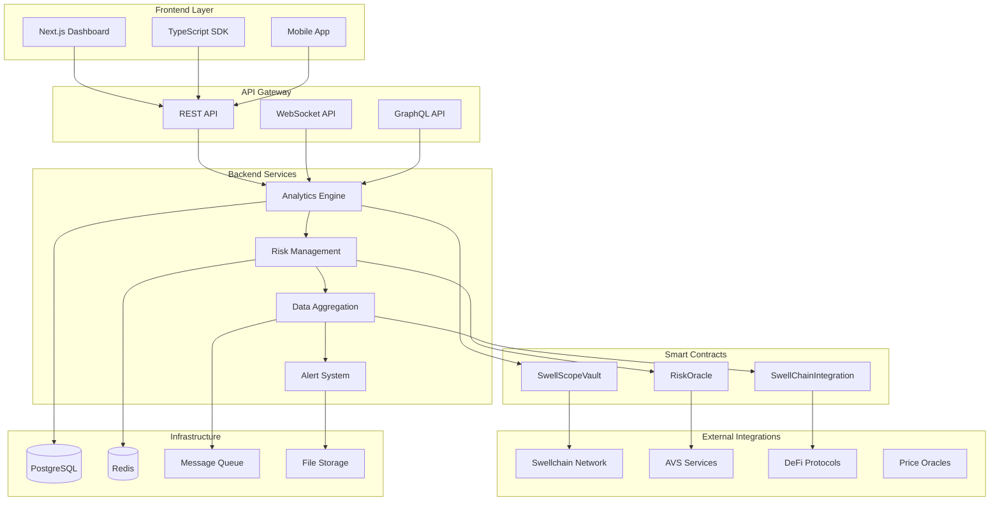
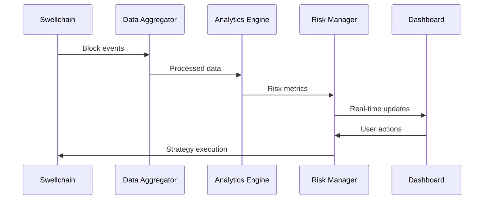
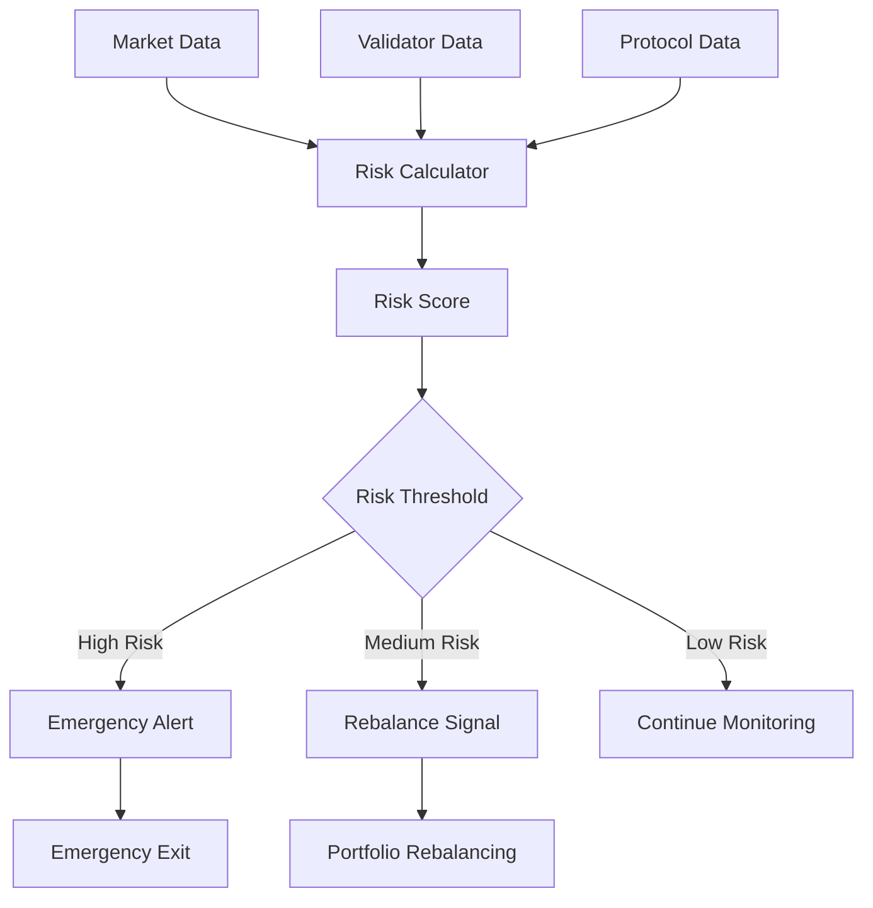
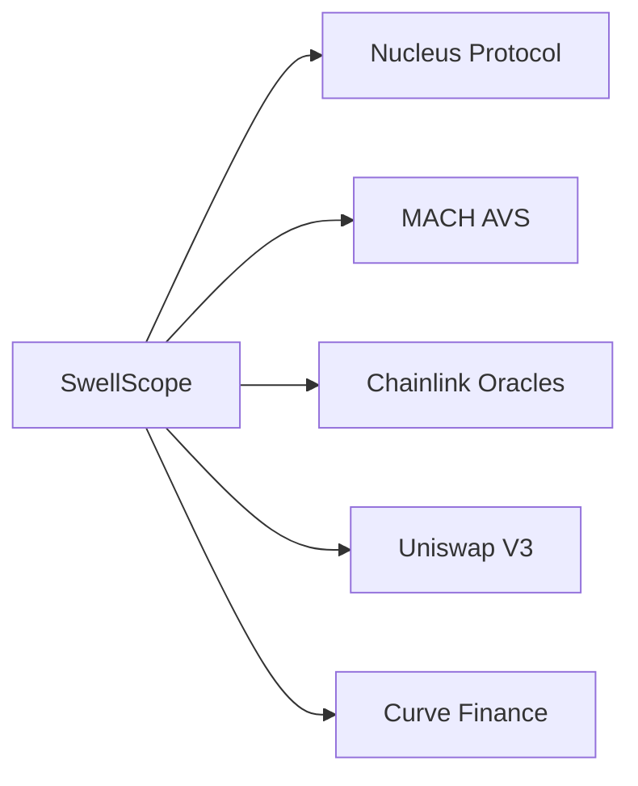
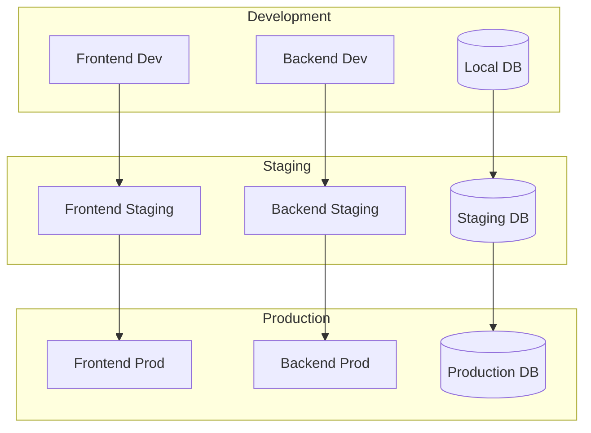

# System Architecture Overview

SwellScope is built as a modular, production-ready platform that provides comprehensive analytics and risk management for Swellchain's restaking ecosystem. This document outlines the high-level architecture and how different components work together.

## Architecture Principles

### 1. **Modular Design**
- Loosely coupled components that can be developed and deployed independently
- Clear separation of concerns between frontend, backend, and smart contracts
- Plugin-based architecture for extending functionality

### 2. **Production-Ready**
- No mocks or simulations - all integrations use real deployed contracts
- Comprehensive error handling and monitoring
- Scalable infrastructure designed for institutional use

### 3. **Security-First**
- Multi-layered security approach
- Automated risk management and emergency procedures
- Regular security audits and penetration testing

## High-Level Architecture

## Core Components

### Frontend Layer

#### **Next.js Dashboard**
- Modern React-based web application
- Real-time data visualization and analytics
- Responsive design for desktop and mobile
- Integrated wallet connection and transaction management

**Key Features:**
- Portfolio overview and management
- Risk assessment dashboards
- Strategy configuration and monitoring
- Cross-chain position tracking

#### **TypeScript SDK**
- Comprehensive client library for developers
- Type-safe interfaces for all API endpoints
- Built-in error handling and retry logic
- Support for both browser and Node.js environments

### Backend Services

#### **Analytics Engine**
- Real-time data processing and aggregation
- Machine learning models for predictive analytics
- Historical data analysis and trend identification
- Performance metrics calculation

**Technologies:**
- Node.js with TypeScript
- TensorFlow.js for ML models
- Apache Kafka for real-time streaming
- TimescaleDB for time-series data

#### **Risk Management Service**
- Continuous risk assessment and monitoring
- Automated alert generation and emergency procedures
- Portfolio optimization algorithms
- Stress testing and scenario analysis

#### **Data Aggregation Service**
- Multi-source data collection and normalization
- Real-time synchronization with blockchain networks
- Data validation and quality assurance
- API rate limiting and caching

### Smart Contract Layer

#### **SwellScopeVault**
- ERC-4626 compliant restaking vault
- Automated strategy execution
- Risk-based position management
- Emergency exit mechanisms

#### **RiskOracle**
- On-chain risk assessment and scoring
- Validator performance tracking
- Slashing risk calculation
- Emergency alert system

#### **SwellChainIntegration**
- Native Swellchain protocol integration
- AVS service monitoring
- Cross-chain position management
- Bridge operation handling

## Data Flow Architecture

### 1. **Real-Time Data Pipeline**

### 2. **Risk Assessment Flow**

## Technology Stack

### **Frontend**
- **Framework**: Next.js 14 with App Router
- **Styling**: Tailwind CSS with shadcn/ui components
- **State Management**: Zustand
- **Web3 Integration**: wagmi + viem
- **Charts**: Recharts / D3.js
- **Testing**: Jest + React Testing Library

### **Backend**
- **Runtime**: Node.js 20+ with TypeScript
- **Framework**: Express.js with Helmet security
- **Database**: PostgreSQL with Prisma ORM
- **Cache**: Redis for session and data caching
- **Queue**: Bull Queue with Redis
- **Monitoring**: Prometheus + Grafana

### **Smart Contracts**
- **Language**: Solidity 0.8.21
- **Framework**: Foundry
- **Testing**: Forge with comprehensive test suites
- **Deployment**: Foundry scripts with verification
- **Standards**: ERC-4626, OpenZeppelin contracts

### **Infrastructure**
- **Cloud**: AWS/GCP with multi-region deployment
- **Containers**: Docker with Kubernetes orchestration
- **CI/CD**: GitHub Actions with automated testing
- **Monitoring**: DataDog for APM and logging
- **Security**: Vault for secret management

## Integration Architecture

### **Swellchain Integration**

SwellScope integrates deeply with Swellchain's infrastructure:

- **Direct RPC Connection**: Real-time blockchain data
- **AVS Monitoring**: MACH, VITAL, SQUAD service tracking
- **Native Token Support**: swETH, rswETH, SWELL integration
- **Bridge Operations**: Cross-chain asset management

### **External Protocol Integration**

## Security Architecture

### **Multi-Layer Security**

1. **Application Layer**
   - Input validation and sanitization
   - Rate limiting and DDoS protection
   - Secure authentication and authorization

2. **Smart Contract Layer**
   - Formal verification of critical functions
   - Multi-signature controls for admin functions
   - Emergency pause mechanisms

3. **Infrastructure Layer**
   - Network segmentation and firewalls
   - Encrypted data transmission (TLS 1.3)
   - Regular security audits and penetration testing

### **Risk Management**

- **Automated Monitoring**: 24/7 system health checks
- **Emergency Procedures**: Automated circuit breakers
- **Incident Response**: Defined escalation procedures
- **Recovery Plans**: Backup and disaster recovery

## Scalability Considerations

### **Horizontal Scaling**
- Microservices architecture for independent scaling
- Load balancing across multiple instances
- Database sharding for large datasets
- CDN for global content delivery

### **Performance Optimization**
- Aggressive caching strategies
- Database query optimization
- Asynchronous processing for heavy operations
- Real-time data streaming with WebSockets

## Deployment Architecture

### **Multi-Environment Setup**

## Monitoring and Observability

### **Application Monitoring**
- Real-time performance metrics
- Error tracking and alerting
- User behavior analytics
- Business metrics dashboards

### **Infrastructure Monitoring**
- Server health and resource utilization
- Database performance monitoring
- Network latency and throughput
- Security event logging

## Future Architecture Considerations

### **Planned Enhancements**
- **Multi-chain Support**: Expand beyond Swellchain
- **AI/ML Integration**: Advanced predictive models
- **Mobile Applications**: Native iOS/Android apps
- **API Marketplace**: Third-party integrations

### **Scalability Roadmap**
- **Microservices Migration**: Further service decomposition
- **Event-Driven Architecture**: Enhanced real-time capabilities
- **Global Distribution**: Multi-region deployment
- **Edge Computing**: Reduced latency for global users

---

This architecture provides a solid foundation for SwellScope's current needs while maintaining flexibility for future growth and evolution. 