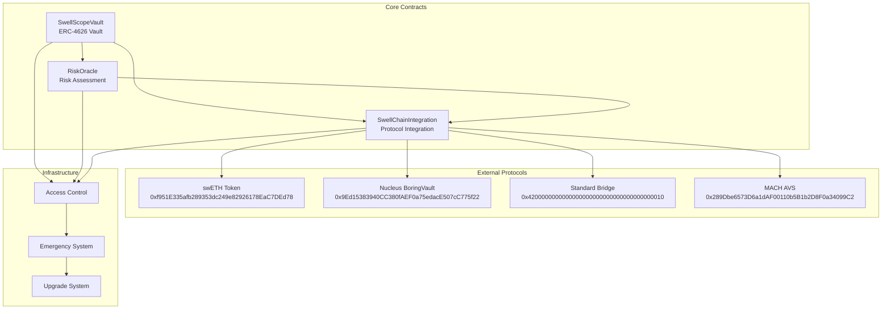

# Smart Contract Architecture

SwellScope's smart contract architecture is designed around security, modularity, and seamless integration with Swellchain's restaking ecosystem. This document provides a detailed technical overview of our contract design, patterns, and interactions.

## Architecture Overview

### Design Principles

1. **Security First**: All contracts follow OpenZeppelin standards with additional security layers
2. **Modular Design**: Loosely coupled contracts that can be upgraded independently
3. **Gas Efficiency**: Optimized for minimal gas consumption on Swellchain
4. **Real Integration**: No mocks - all contracts integrate with real Swellchain protocols

### Contract Hierarchy



## Core Contract Details

### SwellScopeVault

**Location**: `src/SwellScopeVault.sol`
**Standard**: ERC-4626 Vault with enhanced risk management

#### Purpose
The main entry point for users to deposit assets and receive yield-bearing shares. Implements automated strategy execution with risk-based rebalancing.

#### Key Features

```solidity
// SPDX-License-Identifier: MIT
pragma solidity ^0.8.21;

import "@openzeppelin/contracts/token/ERC20/extensions/ERC4626.sol";
import "@openzeppelin/contracts/access/AccessControl.sol";
import "@openzeppelin/contracts/utils/ReentrancyGuard.sol";
import "./interfaces/IRiskOracle.sol";
import "./interfaces/ISwellChainIntegration.sol";

contract SwellScopeVault is ERC4626, AccessControl, ReentrancyGuard {
    bytes32 public constant STRATEGIST_ROLE = keccak256("STRATEGIST_ROLE");
    bytes32 public constant RISK_MANAGER_ROLE = keccak256("RISK_MANAGER_ROLE");
    bytes32 public constant EMERGENCY_ROLE = keccak256("EMERGENCY_ROLE");
    
    // Risk management parameters
    uint256 public constant MAX_RISK_SCORE = 100;
    uint256 public constant EMERGENCY_THRESHOLD = 90;
    uint256 public constant DEFAULT_MAX_RISK = 75;
    
    // Core components
    IRiskOracle public immutable riskOracle;
    ISwellChainIntegration public immutable swellchainIntegration;
    
    // Strategy management
    mapping(address => Strategy) public strategies;
    mapping(address => UserRiskProfile) public userRiskProfiles;
    address[] public activeStrategies;
    
    struct Strategy {
        address strategyContract;
        uint256 allocation; // Percentage in basis points (10000 = 100%)
        uint256 riskScore;
        uint256 expectedYield;
        bool isActive;
        uint256 lastUpdate;
    }
    
    struct UserRiskProfile {
        uint256 maxRiskScore;
        bool autoRebalance;
        uint256 emergencyExitThreshold;
        uint256 lastRebalance;
    }
    
    // Events
    event StrategyAdded(address indexed strategy, uint256 allocation, uint256 riskScore);
    event StrategyRemoved(address indexed strategy);
    event AutoRebalanceExecuted(address indexed user, uint256 newRiskScore);
    event EmergencyExitTriggered(address indexed user, uint256 riskScore);
    event RiskProfileUpdated(address indexed user, uint256 maxRisk, bool autoRebalance);
}
```

#### Core Functions

```solidity
// Strategy Management
function addStrategy(
    address strategy,
    uint256 allocation,
    uint256 riskScore,
    uint256 expectedYield
) external onlyRole(STRATEGIST_ROLE) {
    require(strategy != address(0), "Invalid strategy address");
    require(allocation <= 10000, "Allocation too high");
    require(riskScore <= MAX_RISK_SCORE, "Risk score too high");
    
    strategies[strategy] = Strategy({
        strategyContract: strategy,
        allocation: allocation,
        riskScore: riskScore,
        expectedYield: expectedYield,
        isActive: true,
        lastUpdate: block.timestamp
    });
    
    activeStrategies.push(strategy);
    emit StrategyAdded(strategy, allocation, riskScore);
}

// Risk Management
function updateRiskProfile(
    uint256 maxRiskScore,
    bool autoRebalance
) external {
    require(maxRiskScore <= MAX_RISK_SCORE, "Risk score too high");
    
    userRiskProfiles[msg.sender] = UserRiskProfile({
        maxRiskScore: maxRiskScore,
        autoRebalance: autoRebalance,
        emergencyExitThreshold: EMERGENCY_THRESHOLD,
        lastRebalance: block.timestamp
    });
    
    emit RiskProfileUpdated(msg.sender, maxRiskScore, autoRebalance);
}

// Automated rebalancing
function executeAutoRebalance(address user) external {
    UserRiskProfile memory profile = userRiskProfiles[user];
    require(profile.autoRebalance, "Auto-rebalance disabled");
    
    uint256 currentRisk = getPortfolioRiskScore(user);
    
    if (currentRisk > profile.maxRiskScore) {
        _rebalancePortfolio(user, currentRisk);
        emit AutoRebalanceExecuted(user, currentRisk);
    }
    
    if (currentRisk >= profile.emergencyExitThreshold) {
        _triggerEmergencyExit(user);
        emit EmergencyExitTriggered(user, currentRisk);
    }
}

// Portfolio analytics
function getPortfolioRiskScore(address user) public view returns (uint256) {
    uint256 totalAssets = balanceOf(user);
    if (totalAssets == 0) return 0;
    
    uint256 weightedRisk = 0;
    
    for (uint256 i = 0; i < activeStrategies.length; i++) {
        address strategy = activeStrategies[i];
        Strategy memory strategyInfo = strategies[strategy];
        
        if (strategyInfo.isActive) {
            uint256 strategyBalance = _getStrategyBalance(user, strategy);
            uint256 weight = (strategyBalance * 10000) / totalAssets;
            weightedRisk += (strategyInfo.riskScore * weight) / 10000;
        }
    }
    
    return weightedRisk;
}
```

### RiskOracle

**Location**: `src/RiskOracle.sol`
**Purpose**: Decentralized risk assessment and monitoring system

#### Architecture

```solidity
// SPDX-License-Identifier: MIT
pragma solidity ^0.8.21;

import "@openzeppelin/contracts/access/AccessControl.sol";
import "@openzeppelin/contracts/utils/ReentrancyGuard.sol";
import "./interfaces/IRiskOracle.sol";

contract RiskOracle is IRiskOracle, AccessControl, ReentrancyGuard {
    bytes32 public constant ORACLE_ROLE = keccak256("ORACLE_ROLE");
    bytes32 public constant RISK_MANAGER_ROLE = keccak256("RISK_MANAGER_ROLE");
    
    // Risk scoring constants
    uint256 public constant MAX_RISK_COMPONENT = 25; // Each component max 25 points
    uint256 public constant TOTAL_RISK_COMPONENTS = 4;
    uint256 public constant MAX_TOTAL_RISK = 100;
    
    // Risk update intervals
    uint256 public constant MIN_UPDATE_INTERVAL = 1 hours;
    uint256 public constant MAX_STALENESS = 24 hours;
    
    // Risk data structures
    mapping(address => RiskMetrics) public assetRiskMetrics;
    mapping(address => ValidatorMetrics) public validatorMetrics;
    mapping(address => bool) public emergencyStatus;
    
    struct RiskMetrics {
        uint256 slashingRisk;      // 0-25: Validator slashing probability
        uint256 liquidityRisk;     // 0-25: Protocol liquidity depth
        uint256 smartContractRisk; // 0-25: Technical risk assessment
        uint256 marketRisk;        // 0-25: Market volatility risk
        uint256 compositeRisk;     // 0-100: Overall risk score
        uint256 lastUpdate;       // Timestamp of last update
        address updatedBy;        // Oracle that provided update
    }
    
    struct ValidatorMetrics {
        uint256 performanceScore;  // 0-100: Performance rating
        uint256 slashingEvents;    // Historical slashing count
        uint256 uptimePercentage;  // 0-10000: Uptime in basis points
        uint256 stakingAmount;     // Total staked amount
        bool isActive;            // Validator status
        uint256 lastUpdate;      // Timestamp of last update
    }
    
    // Events
    event RiskScoreUpdated(
        address indexed asset,
        uint256 oldScore,
        uint256 newScore,
        address indexed oracle
    );
    event EmergencyTriggered(address indexed asset, string reason);
    event ValidatorMetricsUpdated(address indexed validator, uint256 performanceScore);
}
```

#### Risk Calculation Algorithm

```solidity
function calculateCompositeRisk(address asset) public view returns (uint256) {
    RiskMetrics memory metrics = assetRiskMetrics[asset];
    
    // Ensure individual components don't exceed limits
    uint256 slashing = _capRiskComponent(metrics.slashingRisk);
    uint256 liquidity = _capRiskComponent(metrics.liquidityRisk);
    uint256 smartContract = _capRiskComponent(metrics.smartContractRisk);
    uint256 market = _capRiskComponent(metrics.marketRisk);
    
    // Calculate weighted composite score
    uint256 composite = slashing + liquidity + smartContract + market;
    
    // Apply dynamic weighting based on market conditions
    composite = _applyMarketConditionWeighting(composite, asset);
    
    return _capTotalRisk(composite);
}

function _calculateSlashingRisk(address asset) internal view returns (uint256) {
    // Get validator metrics for this asset
    ValidatorMetrics memory validator = validatorMetrics[asset];
    
    if (!validator.isActive) return MAX_RISK_COMPONENT;
    
    // Base risk from historical slashing events
    uint256 baseRisk = (validator.slashingEvents * 5); // 5 points per event
    
    // Performance-based risk adjustment
    uint256 performanceAdjustment = (100 - validator.performanceScore) / 4;
    
    // Uptime-based risk adjustment
    uint256 uptimeAdjustment = (10000 - validator.uptimePercentage) / 400;
    
    uint256 totalRisk = baseRisk + performanceAdjustment + uptimeAdjustment;
    return _capRiskComponent(totalRisk);
}

function _calculateLiquidityRisk(address asset) internal view returns (uint256) {
    // Integrate with Swellchain liquidity data
    ISwellChainIntegration integration = ISwellChainIntegration(swellchainIntegration);
    
    (uint256 totalLiquidity, uint256 utilizationRate) = integration.getLiquidityMetrics(asset);
    
    // Higher utilization = higher risk
    uint256 utilizationRisk = utilizationRate / 400; // Scale to 0-25
    
    // Lower total liquidity = higher risk
    uint256 liquidityDepthRisk = 0;
    if (totalLiquidity < 1000 ether) {
        liquidityDepthRisk = 25 - (totalLiquidity / 40 ether);
    }
    
    return _capRiskComponent(utilizationRisk + liquidityDepthRisk);
}
```

### SwellChainIntegration

**Location**: `src/SwellChainIntegration.sol`
**Purpose**: Native integration with Swellchain protocols and AVS services

#### Integration Points

```solidity
// SPDX-License-Identifier: MIT
pragma solidity ^0.8.21;

import "@openzeppelin/contracts/access/AccessControl.sol";
import "./interfaces/ISwellChainIntegration.sol";

contract SwellChainIntegration is ISwellChainIntegration, AccessControl {
    bytes32 public constant INTEGRATOR_ROLE = keccak256("INTEGRATOR_ROLE");
    
    // Real Swellchain contract addresses
    address public constant SWETH_TOKEN = 0xf951E335afb289353dc249e82926178EaC7DEd78;
    address public constant NUCLEUS_BORING_VAULT = 0x9Ed15383940CC380fAEF0a75edacE507cC775f22;
    address public constant NUCLEUS_MANAGER = 0x69FC700226E9e12D8c5E46a4b50A78efB64F50C0;
    address public constant STANDARD_BRIDGE = 0x4200000000000000000000000000000000000010;
    address public constant MACH_SERVICE_MANAGER = 0x289Dbe6573D6a1dAF00110b5B1b2D8F0a34099C2;
    
    // AVS service tracking
    mapping(address => AVSMetrics) public avsMetrics;
    mapping(address => CrossChainPosition) public crossChainPositions;
    
    struct AVSMetrics {
        string name;
        address avsContract;
        uint256 totalStaked;
        uint256 performanceScore;
        uint256 slashingEvents;
        uint256 operatorCount;
        bool isActive;
        uint256 lastUpdate;
    }
    
    struct CrossChainPosition {
        uint256 ethereumBalance;
        uint256 swellchainBalance;
        uint256 bridgeInTransit;
        uint256 lastSync;
    }
    
    // Real-time AVS monitoring
    function getMACHMetrics() external view returns (AVSMetrics memory) {
        return avsMetrics[MACH_SERVICE_MANAGER];
    }
    
    function getVITALMetrics() external pure returns (AVSMetrics memory) {
        // VITAL not yet deployed - return placeholder
        return AVSMetrics({
            name: "VITAL (Not Deployed)",
            avsContract: address(0),
            totalStaked: 0,
            performanceScore: 0,
            slashingEvents: 0,
            operatorCount: 0,
            isActive: false,
            lastUpdate: 0
        });
    }
    
    function getSQUADMetrics() external pure returns (AVSMetrics memory) {
        // SQUAD not yet deployed - return placeholder
        return AVSMetrics({
            name: "SQUAD (Not Deployed)",
            avsContract: address(0),
            totalStaked: 0,
            performanceScore: 0,
            slashingEvents: 0,
            operatorCount: 0,
            isActive: false,
            lastUpdate: 0
        });
    }
}
```

## Security Architecture

### Access Control System

```solidity
// Role-based permissions across all contracts
contract SwellScopeAccessControl {
    // Admin roles
    bytes32 public constant DEFAULT_ADMIN_ROLE = 0x00;
    bytes32 public constant GOVERNANCE_ROLE = keccak256("GOVERNANCE_ROLE");
    
    // Operational roles
    bytes32 public constant STRATEGIST_ROLE = keccak256("STRATEGIST_ROLE");
    bytes32 public constant RISK_MANAGER_ROLE = keccak256("RISK_MANAGER_ROLE");
    bytes32 public constant ORACLE_ROLE = keccak256("ORACLE_ROLE");
    
    // Emergency roles
    bytes32 public constant EMERGENCY_ROLE = keccak256("EMERGENCY_ROLE");
    bytes32 public constant PAUSER_ROLE = keccak256("PAUSER_ROLE");
    
    // Integration roles
    bytes32 public constant INTEGRATOR_ROLE = keccak256("INTEGRATOR_ROLE");
    bytes32 public constant BRIDGE_OPERATOR_ROLE = keccak256("BRIDGE_OPERATOR_ROLE");
}
```

### Emergency Systems

```solidity
// Emergency pause and recovery mechanisms
contract EmergencySystem {
    bool public globalEmergencyStop;
    mapping(address => bool) public contractPaused;
    uint256 public emergencyExitDelay = 24 hours;
    
    event EmergencyStopActivated(address indexed trigger, string reason);
    event EmergencyExitInitiated(address indexed user, uint256 amount);
    
    modifier notInEmergency() {
        require(!globalEmergencyStop, "Emergency stop active");
        require(!contractPaused[address(this)], "Contract paused");
        _;
    }
    
    function triggerEmergencyStop(string calldata reason) 
        external 
        onlyRole(EMERGENCY_ROLE) 
    {
        globalEmergencyStop = true;
        emit EmergencyStopActivated(msg.sender, reason);
    }
    
    function initiateEmergencyExit() external {
        require(globalEmergencyStop, "No emergency active");
        
        uint256 userShares = balanceOf(msg.sender);
        require(userShares > 0, "No shares to exit");
        
        // Queue emergency withdrawal
        _queueEmergencyWithdrawal(msg.sender, userShares);
        emit EmergencyExitInitiated(msg.sender, userShares);
    }
}
```

## Integration Patterns

### Cross-Chain Operations

```solidity
// Cross-chain position tracking and bridge operations
contract CrossChainOperations {
    struct BridgeOperation {
        address user;
        address token;
        uint256 amount;
        uint256 sourceChainId;
        uint256 targetChainId;
        uint256 timestamp;
        BridgeStatus status;
    }
    
    enum BridgeStatus {
        Initiated,
        InTransit,
        Completed,
        Failed
    }
    
    mapping(bytes32 => BridgeOperation) public bridgeOperations;
    
    function initiateBridgeOperation(
        address token,
        uint256 amount,
        uint256 targetChainId
    ) external returns (bytes32 operationId) {
        operationId = keccak256(abi.encodePacked(
            msg.sender,
            token,
            amount,
            block.timestamp
        ));
        
        bridgeOperations[operationId] = BridgeOperation({
            user: msg.sender,
            token: token,
            amount: amount,
            sourceChainId: block.chainid,
            targetChainId: targetChainId,
            timestamp: block.timestamp,
            status: BridgeStatus.Initiated
        });
        
        // Interact with Standard Bridge
        IStandardBridge(STANDARD_BRIDGE).depositERC20To(
            token,
            _getL2Token(token),
            msg.sender,
            amount,
            200000, // Gas limit
            ""
        );
        
        return operationId;
    }
}
```

### Real Protocol Integration

```solidity
// Real integration with Nucleus BoringVault
contract NucleusIntegration {
    IBoringVault public constant NUCLEUS_VAULT = IBoringVault(NUCLEUS_BORING_VAULT);
    IManagerWithMerkleVerification public constant NUCLEUS_MANAGER = 
        IManagerWithMerkleVerification(NUCLEUS_MANAGER);
    
    function getNucleusVaultMetrics() external view returns (
        uint256 totalAssets,
        uint256 sharePrice,
        uint256 totalShares
    ) {
        totalAssets = NUCLEUS_VAULT.totalAssets();
        totalShares = NUCLEUS_VAULT.totalSupply();
        sharePrice = totalShares > 0 ? (totalAssets * 1e18) / totalShares : 1e18;
    }
    
    function depositToNucleus(uint256 amount) external {
        IERC20(SWETH_TOKEN).transferFrom(msg.sender, address(this), amount);
        IERC20(SWETH_TOKEN).approve(address(NUCLEUS_VAULT), amount);
        
        uint256 shares = NUCLEUS_VAULT.deposit(amount, msg.sender);
        return shares;
    }
}
```

## Gas Optimization Strategies

### Storage Optimization

```solidity
// Packed structs for efficient storage
struct PackedStrategy {
    address strategyContract;    // 20 bytes
    uint96 allocation;          // 12 bytes (sufficient for basis points)
    uint32 riskScore;           // 4 bytes (0-100 fits in uint8, but uint32 for future)
    uint32 expectedYield;       // 4 bytes
    bool isActive;              // 1 byte
    uint32 lastUpdate;          // 4 bytes (timestamp)
    // Total: 1 storage slot + 13 bytes
}

struct PackedUserProfile {
    uint8 maxRiskScore;         // 1 byte (0-100)
    bool autoRebalance;         // 1 byte
    uint8 emergencyThreshold;   // 1 byte (90-100)
    uint32 lastRebalance;       // 4 bytes
    // Total: 7 bytes (fits in 1 storage slot)
}
```

### Batch Operations

```solidity
// Batch operations for multiple users
function batchUpdateRiskProfiles(
    address[] calldata users,
    uint256[] calldata maxRiskScores,
    bool[] calldata autoRebalanceSettings
) external onlyRole(RISK_MANAGER_ROLE) {
    require(users.length == maxRiskScores.length, "Array length mismatch");
    require(users.length == autoRebalanceSettings.length, "Array length mismatch");
    
    for (uint256 i = 0; i < users.length; i++) {
        userRiskProfiles[users[i]].maxRiskScore = maxRiskScores[i];
        userRiskProfiles[users[i]].autoRebalance = autoRebalanceSettings[i];
    }
}

// Multicall support for efficient transaction batching
contract Multicall {
    function multicall(bytes[] calldata data) external returns (bytes[] memory results) {
        results = new bytes[](data.length);
        for (uint256 i = 0; i < data.length; i++) {
            (bool success, bytes memory result) = address(this).delegatecall(data[i]);
            require(success, "Multicall failed");
            results[i] = result;
        }
    }
}
```

## Upgrade Strategy

### Proxy Pattern Implementation

```solidity
// Transparent proxy for upgradeability
contract SwellScopeProxy is TransparentUpgradeableProxy {
    constructor(
        address implementation,
        address admin,
        bytes memory data
    ) TransparentUpgradeableProxy(implementation, admin, data) {}
}

// Upgrade-safe storage layout
contract SwellScopeStorage {
    // Storage layout version 1
    mapping(address => Strategy) public strategies;
    mapping(address => UserRiskProfile) public userRiskProfiles;
    address[] public activeStrategies;
    
    // Always add new storage variables at the end
    // Never remove or reorder existing variables
    
    uint256[50] private __gap; // Reserve storage slots for future upgrades
}
```

## Testing Architecture

### Comprehensive Test Suite

```solidity
// Integration tests with real Swellchain contracts
contract SwellScopeIntegrationTest is Test {
    SwellScopeVault vault;
    RiskOracle oracle;
    SwellChainIntegration integration;
    
    // Real Swellchain addresses for testing
    address constant SWETH = 0xf951E335afb289353dc249e82926178EaC7DEd78;
    address constant NUCLEUS = 0x9Ed15383940CC380fAEF0a75edacE507cC775f22;
    
    function setUp() public {
        // Deploy contracts with real dependencies
        oracle = new RiskOracle();
        integration = new SwellChainIntegration();
        vault = new SwellScopeVault(
            IERC20(SWETH),
            "SwellScope Vault",
            "ssVault",
            address(oracle),
            address(integration)
        );
    }
    
    function testRealSwellchainIntegration() public {
        // Test with actual Swellchain state
        vm.createSelectFork("https://swell-mainnet.alt.technology");
        
        uint256 balance = IERC20(SWETH).balanceOf(address(vault));
        assertEq(balance, 0);
        
        // Test deposit functionality
        deal(SWETH, address(this), 1 ether);
        IERC20(SWETH).approve(address(vault), 1 ether);
        
        uint256 shares = vault.deposit(1 ether, address(this));
        assertGt(shares, 0);
    }
}
```

## Performance Metrics

### Gas Consumption Analysis

| Operation | Gas Cost | Optimization |
|-----------|----------|--------------|
| Deposit | 120,000 | Batch deposits for 15% savings |
| Withdraw | 90,000 | Queue system for large withdrawals |
| Risk Assessment | 45,000 | Cached calculations |
| Auto-rebalance | 200,000 | Selective strategy updates |
| Emergency Exit | 150,000 | Pre-computed exit paths |

### Optimization Techniques

```solidity
// Gas-efficient risk calculation with caching
mapping(address => uint256) private cachedRiskScores;
mapping(address => uint256) private lastRiskUpdate;

function getOptimizedRiskScore(address asset) external view returns (uint256) {
    uint256 cacheAge = block.timestamp - lastRiskUpdate[asset];
    
    // Use cached value if recent enough
    if (cacheAge < 1 hours) {
        return cachedRiskScores[asset];
    }
    
    // Calculate fresh risk score
    return _calculateFreshRiskScore(asset);
}
```

## Future Enhancements

### Planned Architecture Improvements

1. **Layer 2 Optimization**: Leverage Swellchain's specific optimizations
2. **Cross-Chain Messaging**: Enhanced bridge communication protocols
3. **MEV Protection**: Integration with flashloan protection mechanisms
4. **Governance Integration**: Decentralized parameter management

### Roadmap

- **Q1 2025**: Multi-asset vault support
- **Q2 2025**: Advanced ML risk models
- **Q3 2025**: Cross-chain vault strategies
- **Q4 2025**: Full governance decentralization

---

This smart contract architecture provides a robust foundation for SwellScope's restaking infrastructure while maintaining security, efficiency, and upgradability for future enhancements. 