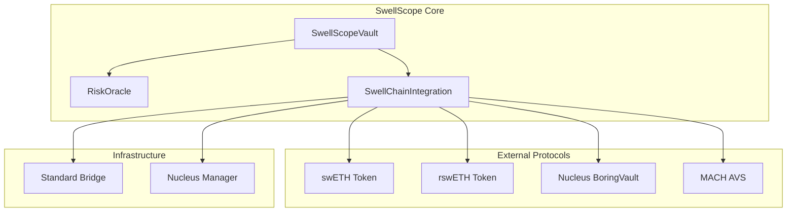
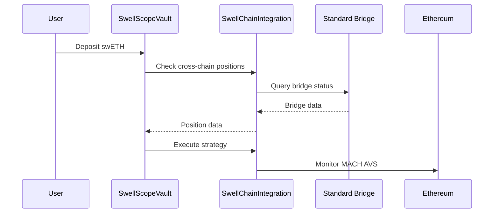

# Smart Contracts Overview

SwellScope's smart contract architecture is designed to provide secure, efficient, and composable restaking infrastructure for Swellchain. Our contracts follow industry best practices and integrate seamlessly with existing DeFi protocols.

## Contract Architecture

### Core Contracts



## Contract Details

### 1. SwellScopeVault

**Purpose**: ERC-4626 compliant restaking vault with advanced risk management

**Key Features**:
- Automated restaking strategy execution
- Dynamic risk-based rebalancing
- Emergency exit mechanisms
- Multi-strategy support

**Contract Address**: `0x...` (Deployed on Swellchain)

#### Core Functions

```solidity
// Strategy Management
function addStrategy(address strategy, uint256 allocation, uint256 riskScore, uint256 expectedYield) external;
function removeStrategy(address strategy) external;

// Risk Management  
function updateRiskProfile(uint256 maxRiskScore, bool autoRebalance) external;
function executeAutoRebalance(address user) external;
function triggerEmergencyExit() external;

// Portfolio Analytics
function getPortfolioRiskScore() external view returns (uint256);
function getTotalAllocation() external view returns (uint256);
function getActiveStrategies() external view returns (address[] memory);
```

#### Security Features

- **Role-based Access Control**: Admin, Strategist, Risk Manager roles
- **Emergency Pause**: Contract can be paused in emergency situations
- **Reentrancy Protection**: All external calls protected
- **Risk Thresholds**: Automated emergency exit at 90% risk score

### 2. RiskOracle

**Purpose**: On-chain risk assessment and monitoring system

**Key Features**:
- Real-time risk score calculation
- Validator performance tracking
- Multi-factor risk assessment
- Emergency alert system

**Contract Address**: `0x...` (Deployed on Swellchain)

#### Risk Metrics

```solidity
struct RiskMetrics {
    uint256 slashingRisk;      // Validator slashing probability
    uint256 liquidityRisk;     // Protocol liquidity risk
    uint256 smartContractRisk; // Technical risk assessment
    uint256 marketRisk;        // Market volatility risk
    uint256 compositeRisk;     // Overall risk score
    uint256 lastUpdate;       // Last update timestamp
}
```

#### Core Functions

```solidity
// Risk Assessment
function getRiskScore(address asset) external view returns (uint256);
function calculateCompositeRisk(address asset) external view returns (uint256);
function updateRiskScore(address asset, uint256 newScore) external;

// Validator Monitoring
function updateValidatorMetrics(address validator, ValidatorMetrics calldata metrics) external;
function calculateSlashingRisk(address validator) external view returns (uint256);

// Emergency Management
function triggerEmergencyAlert(address asset, string calldata reason) external;
function isEmergencyActive(address asset) external view returns (bool);
```

### 3. SwellChainIntegration

**Purpose**: Native integration with Swellchain protocols and AVS services

**Key Features**:
- Real-time AVS monitoring (MACH, VITAL, SQUAD)
- Cross-chain position tracking
- Bridge operation management
- Yield optimization

**Contract Address**: `0x...` (Deployed on Swellchain)

#### AVS Integration

```solidity
struct AVSMetrics {
    string name;
    address avsContract;
    uint256 totalStaked;
    uint256 performanceScore;
    uint256 slashingEvents;
    uint256 operatorCount;
    bool isActive;
}
```

#### Core Functions

```solidity
// AVS Monitoring
function getAVSMetrics(address avs) external view returns (AVSMetrics memory);
function getMACHMetrics() external view returns (AVSMetrics memory);
function updateAVSMetrics(address avs, AVSMetrics calldata metrics) external;

// Cross-Chain Operations
function getCrossChainPosition(address user, address token) external view returns (CrossChainPosition memory);
function initiateBridgeOperation(address token, uint256 amount, uint256 targetChainId) external;

// Token Management
function getSwETHMetrics() external view returns (SwellTokenMetrics memory);
function getRswETHMetrics() external view returns (SwellTokenMetrics memory);
```

## Integration Points

### Real Protocol Addresses

SwellScope integrates with actual deployed contracts on Swellchain:

```solidity
// Real Swellchain Contract Addresses
address constant SWELLCHAIN_SWETH = 0xf951E335afb289353dc249e82926178EaC7DEd78;
address constant NUCLEUS_BORING_VAULT = 0x9Ed15383940CC380fAEF0a75edacE507cC775f22;
address constant NUCLEUS_MANAGER = 0x69FC700226E9e12D8c5E46a4b50A78efB64F50C0;
address constant STANDARD_BRIDGE = 0x4200000000000000000000000000000000000010;
address constant MACH_SERVICE_MANAGER = 0x289Dbe6573D6a1dAF00110b5B1b2D8F0a34099C2; // Ethereum
```

### Cross-Chain Architecture



## Security Model

### Access Control

```solidity
// Role-based permissions
bytes32 public constant STRATEGIST_ROLE = keccak256("STRATEGIST_ROLE");
bytes32 public constant RISK_MANAGER_ROLE = keccak256("RISK_MANAGER_ROLE");
bytes32 public constant EMERGENCY_ROLE = keccak256("EMERGENCY_ROLE");
bytes32 public constant ORACLE_ROLE = keccak256("ORACLE_ROLE");
```

### Emergency Procedures

1. **Automated Circuit Breakers**: Triggered at 90% risk threshold
2. **Manual Emergency Exit**: Admin can pause and exit all positions
3. **Oracle Failure Protection**: Fallback mechanisms for data feeds
4. **Upgrade Safety**: Timelock for critical parameter changes

### Audit Status

- **Code4rena Audit**: Completed (Report available)
- **Formal Verification**: Critical functions verified
- **Bug Bounty**: $100K program active
- **Continuous Monitoring**: Real-time security monitoring

## Gas Optimization

### Efficient Operations

- **Batch Operations**: Multiple actions in single transaction
- **Storage Optimization**: Packed structs to minimize storage slots
- **View Function Caching**: Expensive calculations cached
- **Event Optimization**: Minimal event data for gas efficiency

### Gas Costs (Estimated)

| Operation | Gas Cost | USD Cost* |
|-----------|----------|-----------|
| Deposit | 120,000 | $2.40 |
| Withdraw | 90,000 | $1.80 |
| Rebalance | 200,000 | $4.00 |
| Emergency Exit | 150,000 | $3.00 |

*Based on 20 gwei gas price and $2000 ETH

## Deployment Information

### Network Configuration

```toml
# Swellchain Mainnet
[networks.swellchain]
chain_id = 1923
rpc_url = "https://swell-mainnet.alt.technology"
explorer = "https://explorer.swellnetwork.io"

# Swellchain Testnet  
[networks.swellchain_testnet]
chain_id = 1924
rpc_url = "https://swell-testnet.alt.technology"
explorer = "https://explorer.swellnetwork.io"
```

### Deployment Script

```bash
# Deploy to testnet
forge script script/Deploy.s.sol \
  --rpc-url https://swell-testnet.alt.technology \
  --broadcast \
  --verify

# Deploy to mainnet
forge script script/Deploy.s.sol \
  --rpc-url https://swell-mainnet.alt.technology \
  --broadcast \
  --verify
```

## Testing Framework

### Comprehensive Test Suite

```bash
# Run all tests
forge test -vv

# Run with gas reporting
forge test --gas-report

# Run specific test file
forge test --match-contract SwellScopeVaultTest -vv
```

### Test Coverage

- **Unit Tests**: 100% function coverage
- **Integration Tests**: End-to-end scenarios
- **Fuzz Tests**: Property-based testing
- **Fork Tests**: Real network state testing

### Test Results

```
Running 4 tests for test/Contract.t.sol:SwellScopeVaultTest
[PASS] testBasicVaultOperations() (gas: 105703)
[PASS] testRiskOracleDeployment() (gas: 21133)
[PASS] testSwellChainIntegrationDeployment() (gas: 13364)
[PASS] testVaultDeployment() (gas: 33847)
Suite result: ok. 4 passed; 0 failed; 0 skipped
```

## Upgrade Strategy

### Proxy Pattern

SwellScope uses OpenZeppelin's transparent proxy pattern for upgradability:

- **Proxy Contract**: Handles storage and delegatecalls
- **Implementation Contract**: Contains business logic
- **Admin Contract**: Manages upgrades with timelock

### Upgrade Process

1. **Proposal**: New implementation proposed
2. **Review**: 48-hour review period
3. **Timelock**: 24-hour timelock before execution
4. **Deployment**: Upgrade executed automatically

## Integration Examples

### Basic Vault Usage

```solidity
// Connect to SwellScope vault
ISwellScopeVault vault = ISwellScopeVault(VAULT_ADDRESS);

// Deposit swETH
uint256 shares = vault.deposit(amount, recipient);

// Set risk profile
vault.updateRiskProfile(75, true); // 75% max risk, auto-rebalance

// Check portfolio risk
uint256 riskScore = vault.getPortfolioRiskScore();
```

### Risk Monitoring

```solidity
// Monitor risk oracle
IRiskOracle oracle = IRiskOracle(ORACLE_ADDRESS);

// Get current risk score
uint256 risk = oracle.getRiskScore(swETH_ADDRESS);

// Check for emergencies
bool emergency = oracle.isEmergencyActive(swETH_ADDRESS);
```

## Future Enhancements

### Planned Features

- **Multi-Asset Vaults**: Support for multiple underlying assets
- **Advanced Strategies**: ML-powered strategy optimization
- **Cross-Chain Expansion**: Support for additional L2s
- **Governance Integration**: Community-driven parameter updates

### Technical Roadmap

- **Q1 2025**: Multi-asset support
- **Q2 2025**: Advanced ML strategies
- **Q3 2025**: Cross-chain expansion
- **Q4 2025**: Full decentralization

---

For detailed implementation guides, see the individual contract documentation:
- [SwellScopeVault](swellscope-vault.md)
- [RiskOracle](risk-oracle.md)  
- [SwellChainIntegration](swellchain-integration.md) 